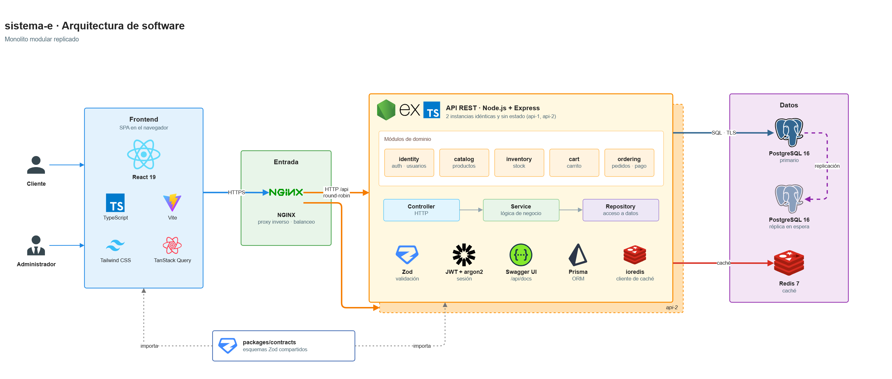

# sistema-e

Tienda en línea (e-commerce) con catálogo, carrito, pedidos con pago simulado, reseñas y administración de productos, inventario y usuarios. Está construida con una arquitectura distribuida:

- NGINX como punto de entrada y balanceador;
- dos instancias de una API REST en Node.js;
- PostgreSQL con primario y réplica;
- Redis como caché.

Todo corre en cinco máquinas virtuales, con servicios nativos de Linux administrados por systemd.



## Qué hace

| Usuario | Funcionalidades |
|---|---|
| **Cliente** | Registrarse · iniciar sesión · consultar, buscar y filtrar productos (categoría, precio, popularidad, paginación) · gestionar su carrito · crear pedidos · pago simulado · historial de pedidos · reseñar los productos que compró |
| **Administrador** | Iniciar sesión · crear, editar y eliminar productos (con imagen por URL o archivo) · gestionar categorías · gestionar inventario · listar y consultar usuarios y sus pedidos · bloquear y desbloquear cuentas · eliminar reseñas |

Una cuenta bloqueada no puede iniciar sesión ni usar funcionalidades protegidas, y el bloqueo tiene efecto inmediato en las dos instancias de la API.

## Stack

| Capa | Tecnología |
|---|---|
| Frontend | React 19 · TypeScript · Vite · Tailwind CSS v4 · React Router · TanStack Query · react-hook-form |
| Backend | Node.js 24 LTS · Express 5 · TypeScript · Prisma 7 (con `@prisma/adapter-pg`) · Zod 4 · argon2 · jsonwebtoken · ioredis · pino · helmet |
| Contratos | `packages/contracts`: esquemas Zod y tipos DTO compartidos entre frontend y backend |
| Documentación de la API | OpenAPI generado desde Zod (zod-to-openapi) + Swagger UI en `/api/docs` |
| Base de datos | PostgreSQL 16: un primario y una réplica asíncrona en espera, con failover manual |
| Caché | Redis 7, solo para el listado de productos y las categorías |
| Entrada y balanceo | NGINX: HTTPS, SPA estática, balanceo round-robin entre las 2 instancias de la API |
| Infraestructura | 5 VMs Ubuntu Server 24.04 en VirtualBox, creadas con Vagrant; servicios administrados con systemd |
| Monorepo | pnpm 11.3 workspaces |

## Inicio rápido

En un equipo con VirtualBox 7.1+, Vagrant y Git (en Windows, desde **Git Bash**):

```bash
git clone https://github.com/ssvalen/sistema-ecommerce.git sistema-e
cd sistema-e
bash deploy/init-secrets.sh      # genera deploy/secrets.env con contraseñas aleatorias
vagrant up                       # crea las 5 VMs y deja el sistema funcionando
vagrant ssh app1 -c "sudo bash /vagrant/deploy/app/seed-demo.sh"   # opcional: datos de demostración
```

Luego importa la CA local (`.release/tls/sistema-e-ca.crt`, ver [guía técnica §4](docs/guia-tecnica.md)) y abre https://192.168.56.10. Las credenciales del administrador están en `deploy/secrets.env` (`ADMIN_EMAIL` y `ADMIN_PASSWORD`).

La [guía técnica](docs/guia-tecnica.md) explica cada paso desde cero, las demostraciones (balanceo, caídas, replicación y failover) y el entorno de desarrollo.

## Documentación

| Documento | Contenido |
|---|---|
| [Guía técnica](docs/guia-tecnica.md) | Requisitos, instalación paso a paso, scripts disponibles, demostraciones, operación, problemas frecuentes y entorno de desarrollo |
| [Arquitectura de software](docs/arquitectura.md) | Componentes, backend por capas y módulos, frontend, flujos críticos, caché, seguridad y escalabilidad |
| [Infraestructura: cómo funciona y por qué](docs/infraestructura-explicada.md) | Explicación de punta a punta: qué se usa y por qué, recorrido de una request, balanceo de carga, certificado HTTPS y CA local, replicación, failover, caché y despliegues |
| [Infraestructura: referencia de configuración](docs/infraestructura.md) | VMs, red y firewall, configuración de NGINX, systemd, PostgreSQL y Redis, replicación, failover, modos de fallo y despliegues |
| [Base de datos](docs/base-de-datos.md) | Modelo entidad-relación, tablas, constraints, índices, transacciones y roles |
| [API REST](docs/api.md) | Endpoints, autenticación, formato de respuestas, códigos HTTP y de error, Swagger/OpenAPI |
| [Decisiones de diseño](docs/decisiones-de-diseno.md) | El porqué de cada decisión, las alternativas descartadas y los límites conocidos |
| [Requerimientos](docs/requerimientos.md) | Requisitos funcionales y técnicos del sistema |
| [Trazabilidad](docs/trazabilidad.md) | Cada requisito con su implementación y cómo verificarlo |
| [Diagramas](docs/diagramas/) | `arquitectura.drawio` e `infraestructura.drawio` (editables en draw.io), con su exportación PNG |

## Estructura del repositorio

```
sistema-e/
  Vagrantfile             las 5 VMs de la instalación
  package.json            scripts raíz · packageManager: pnpm@11.3.0
  pnpm-workspace.yaml     workspaces y dependencias autorizadas a ejecutar scripts de instalación
  packages/contracts/     esquemas Zod y tipos DTO compartidos
  backend/                API REST (Express 5 + Prisma)
  frontend/               SPA (React 19 + Vite)
  deploy/                 scripts de instalación, publicación, failover y demostración
  dev/                    PostgreSQL y Redis en contenedores Podman, para desarrollo
  docs/                   documentación
```
