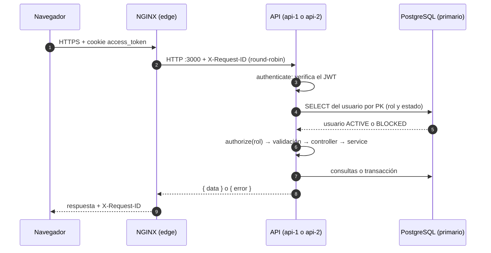
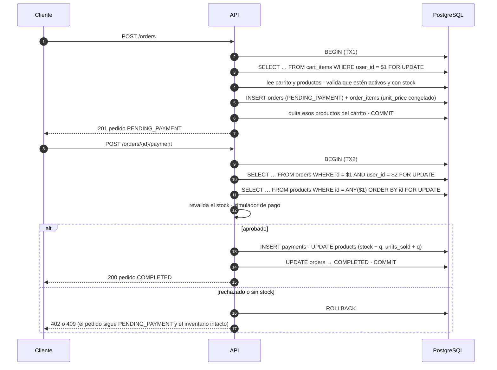

# Arquitectura de software

sistema-e es una tienda en línea con dos tipos de usuario:

- **Cliente:** se registra, consulta y filtra el catálogo, administra su carrito, compra con un pago simulado, consulta su historial y reseña los productos que compró.
- **Administrador:** gestiona productos, categorías, inventario y usuarios (incluido el bloqueo de cuentas), consulta los pedidos de cada cliente y modera las reseñas.

Este documento describe cómo está construido el software: sus componentes, cómo se reparten las responsabilidades y cómo fluyen las operaciones críticas. Las máquinas, la red y la configuración de cada servicio están en [infraestructura.md](infraestructura.md). El porqué de cada decisión está en [decisiones-de-diseno.md](decisiones-de-diseno.md).

## 1. Descripción general

sistema-e es un **monolito modular replicado**:

- **SPA en React:** corre en el navegador. NGINX la sirve como archivos estáticos.
- **API REST en Node.js y Express:**
  - Está organizada en módulos por contexto de negocio y se despliega como una sola unidad.
  - Corre en **dos instancias idénticas y sin estado**, `api-1` y `api-2`, cada una en su propia máquina virtual.
- **NGINX:** es el único punto de entrada. Termina HTTPS, sirve la SPA, reparte las requests de la API entre las dos instancias y cachea las imágenes.
- **PostgreSQL 16:** es la única fuente de verdad. Tiene una réplica asíncrona en espera, que permite recuperarse de la pérdida del primario.
- **Redis 7:** cachea las lecturas más frecuentes del catálogo. Es desechable: si falla, la API lee de PostgreSQL.

```
Navegador ─HTTPS─▶ NGINX (edge) ─HTTP─▶ api-1 (app1) ┐
                                    └─▶ api-2 (app2) ┴─▶ PostgreSQL primario (data1) ──replicación──▶ réplica (data2)
                                                     └─▶ Redis (data2)
```

Entre paréntesis está la VM donde corre cada componente en la instalación en VMs.

## 2. Diagrama de arquitectura


Fuente editable: [diagramas/arquitectura.drawio](diagramas/arquitectura.drawio). Se abre con [draw.io](https://app.diagrams.net).

## 3. Componentes

| Componente | Tecnología | Responsabilidad |
|---|---|---|
| SPA | React 19 · TypeScript · Vite · Tailwind CSS v4 · React Router · TanStack Query · react-hook-form | Interfaz de cliente y de administración. Muestra lo que devuelve la API; no calcula precios, totales ni stock |
| NGINX | NGINX de Ubuntu 24.04 | TLS, redirección de HTTP a HTTPS, SPA estática, balanceo round-robin, reintentos seguros, caché de imágenes, cabeceras de seguridad, `X-Request-ID` |
| API REST | Node.js 24 LTS · Express 5 · TypeScript | Toda la lógica de negocio: autenticación, autorización, validación, transacciones y caché |
| Contratos | `packages/contracts` (Zod 4) | Forma y formato de los datos que viajan entre la SPA y la API. Sin reglas de negocio |
| Acceso a datos | Prisma 7 con `@prisma/adapter-pg` | Cliente tipado, migraciones y transacciones interactivas |
| Base de datos | PostgreSQL 16 | Datos de negocio e imágenes subidas. Integridad con PK, FK, UNIQUE y CHECK. Locks de fila para la concurrencia |
| Réplica | PostgreSQL 16 en espera (hot standby) | Copia asíncrona del primario. No atiende tráfico: solo toma el relevo durante un failover |
| Caché | Redis 7 + ioredis | Listado de productos y categorías, con invalidación por versión |
| Documentación de la API | zod-to-openapi + Swagger UI | Especificación OpenAPI generada a partir de los mismos esquemas que validan |

Otras librerías del backend: argon2 (contraseñas), jsonwebtoken (sesión), helmet (cabeceras), cookie-parser, multer (subida de imágenes en memoria), file-type (detección del tipo de imagen) y pino (logs).

## 4. Principios

- **Instancias sin estado:**
  - Todo el estado vive en PostgreSQL (incluidas las imágenes subidas) o en Redis.
  - Cualquier instancia atiende cualquier request, y si una cae, la otra continúa.
- **Un solo dueño de los datos:**
  - El primario es la única fuente de verdad.
  - La réplica no atiende lecturas, para que nadie deje de ver lo que acaba de escribir.
- **Mismo origen:** la SPA, la API y las imágenes se sirven desde el mismo dominio. No hace falta CORS, que queda deshabilitado.
- **La lógica de negocio vive solo en el backend:**
  - El frontend no la duplica.
  - La base de datos impide estados imposibles con constraints, que son la última defensa, no la regla.
- **Solo NGINX recibe tráfico externo.** Las demás VMs aceptan conexiones solo desde la red privada y solo de quien las necesita.

## 5. Backend

### Capas

```
request → authenticate / authorize → validación (Zod) → controller → service → repository → PostgreSQL
                                                                            └→ caché (Redis)
```

| Capa | Hace | No hace |
|---|---|---|
| Middlewares de ruta | `authenticate` verifica la sesión; `authorize(rol)` verifica el rol | Validar el formato de la request |
| `handler(schemas, fn)` | Valida body, query y params con Zod. Si algo falla, responde 400 con todos los problemas; si no, entrega los datos tipados al controller | Lógica de negocio |
| Controller | Llama al service y mapea el resultado a un DTO de `contracts` | Lógica de negocio ni acceso a datos |
| Service | Reglas de negocio; decide dónde empieza y termina cada transacción | Conocer HTTP |
| Repository | Único lugar que usa Prisma. Recibe un ejecutor (el cliente de Prisma o el de una transacción), para que el service pueda componer operaciones | Devolver tipos de Prisma hacia HTTP |

- **Primero se autentica y después se valida:** así, a quien no tiene sesión no se le revela qué formato espera la API.
- **Los tipos generados por Prisma nunca llegan a una respuesta:** el controller siempre los mapea de forma explícita. Así no se filtran campos como `password_hash` y se controla cómo se serializan los montos.

**Middlewares globales**, en orden:

1. `http-logger` (pino-http): toma el `X-Request-ID` que envía NGINX (o genera uno en desarrollo), lo devuelve en la respuesta y lo agrega a cada línea de log junto con `INSTANCE_ID`.
2. Swagger UI en `/api/docs`, con su propia política de seguridad de contenido (CSP).
3. `helmet`: cabeceras de seguridad.
4. Lectura de JSON, con un límite de 100 KB por body.
5. `cookie-parser`: lee la cookie de sesión.
6. Al final, `notFoundHandler` y `errorHandler`, que traducen cualquier error a la forma `{ "error": { code, message, details } }`.

### Módulos (bounded contexts)

| Módulo | Responsabilidad | Tablas que escribe |
|---|---|---|
| `identity` | Registro, login, logout, sesión, usuarios y bloqueo | `users` |
| `catalog` | Categorías y productos (datos descriptivos y borrado lógico), imágenes, y el listado con búsqueda, filtros, orden y paginación | `categories`, `products` (datos descriptivos), `product_images` |
| `inventory` | Stock y unidades vendidas: ajuste por delta y descuento dentro de la transacción de pago | `products.stock`, `products.units_sold` |
| `cart` | Carrito del cliente, con validación de stock, subtotales y total | `cart_items` |
| `ordering` | Creación de pedidos, pago simulado, historial y detalle (del cliente y para el administrador) | `orders`, `order_items`, `payments` |
| `reviews` | Reseñas de productos comprados, su moderación y la calificación promedio | `reviews` |

**Reglas entre módulos:**

- **Fronteras:** un módulo nunca usa el repositorio ni las tablas de otro. Llama a las funciones que el otro expone en su `index.ts`.
- **Transacciones que cruzan módulos:** reciben el cliente de la transacción. Por ejemplo, `ordering` abre la transacción del pago y llama a las funciones de `inventory` que bloquean y descuentan el stock.
- **Un único escritor por columna:** `products` es compartida. `catalog` escribe los datos descriptivos e `inventory`, `stock` y `units_sold`. Las lecturas para mostrar sí pueden hacer join.
- **Dependencias:**

  | Módulo | Usa |
  |---|---|
  | `ordering` | `cart`, `inventory`, `catalog` |
  | `cart` | `catalog`, `inventory` |
  | `reviews` | `catalog` (el producto existe y está activo) y `ordering` (el cliente lo compró) |
  | Todos | Los middlewares de `identity` |

- **Referencias mutuas:** hay dos.
  - `catalog` llama a `cart` para quitar de los carritos un producto eliminado.
  - `catalog` llama a `reviews` para obtener la calificación de los productos que lista.

  No forman ciclos de importación: cada `index.ts` expone solo las funciones puntuales que necesitan los demás e importa únicamente archivos de su propio módulo (repositorio y mappers), nunca su service.

### Estructura

```
backend/
  src/
    config/        variables de entorno, validadas con Zod al arrancar
    db/            cliente Prisma, withTransaction, opciones TLS
    cache/         cliente Redis y caché del catálogo
    http/          handler (validación) y helpers de respuesta
    middlewares/   http-logger, error-handler
    errors/        AppError y sus subclases, traducción de errores de la base
    docs/          registro OpenAPI y Swagger UI
    lib/           logger (pino)
    modules/       identity, catalog, inventory, cart, ordering, reviews
                   (cada uno con routes, controller, service, repository, openapi, index)
    app.ts         composición de Express
    server.ts      arranque y apagado ordenado
  prisma/          schema.prisma y migraciones
  scripts/         create-admin.ts, seed-demo.ts, verify-db.ts
```

### Operación

- **Trazabilidad de requests:** NGINX genera un `X-Request-ID` por request y la API lo registra junto con `INSTANCE_ID`. Así se ve qué instancia atendió cada request.
- **Logs:** pino escribe JSON a stdout, y systemd lo envía a journald.
- **Apagado ordenado:** ante `SIGTERM`, la API deja de aceptar conexiones, termina las requests en curso (con un límite de 10 s) y cierra el pool de PostgreSQL y la conexión a Redis.
- **Arranque tolerante:** arranca aunque la base no esté disponible. Mientras tanto, las requests que la necesitan reciben 503.
- **Configuración por variables de entorno:** se validan al arrancar. Si falta alguna o es inválida, la API termina con un mensaje claro que no muestra los valores.
- **Primario configurable:** la dirección del primario viene de `DATABASE_URL`. Tras un failover se actualiza y se reinician las instancias de forma escalonada.
- **Salud:** `GET /health` informa la instancia y el estado de la base y de la caché.
- **Keep-alive:** el `keepAliveTimeout` de Node es de 65 s, mayor que el tiempo con que NGINX reutiliza las conexiones hacia la API. Así Node nunca cierra primero un socket que NGINX está por reutilizar, lo que produciría un 502.

## 6. Frontend

- **Estado del servidor:** TanStack Query.
- **Sesión:** se obtiene de `GET /auth/me` y vive en la caché de TanStack Query. Se recupera sola al recargar la página. No hay Redux ni un store propio.
- **Formularios:** react-hook-form, con los esquemas Zod de `packages/contracts`. El frontend valida con las mismas reglas de formato que el backend.
- **Organización:** por dominio, con los mismos módulos que el backend.
  - De Domain-Driven Design se toma solo la parte estratégica: contextos, lenguaje común y fronteras.
  - La parte táctica (entidades, value objects, casos de uso) no aporta, porque la lógica vive en el backend.

```
frontend/src/
  app/       router, guards por rol, layouts (tienda y administración), cliente de TanStack Query
  shared/    http (cliente fetch, ApiError, claves de caché), ui (componentes base, toasts), lib (formato, paginación)
  modules/
    identity/   login, registro, sesión · admin: usuarios y bloqueo
    catalog/    catálogo, búsqueda, filtros, detalle · admin: productos, categorías, imagen
    inventory/  admin: stock y ajustes
    cart/       carrito
    ordering/   crear pedido, pago simulado, historial, detalle · admin: pedidos de un cliente
    reviews/    reseñas del producto, reseña propia · admin: eliminar reseñas
```

**Forma de cada módulo:** `api.ts` (llamadas HTTP) → `hooks.ts` (queries y mutations) → `components/` → `pages/`, con `index.ts` como API pública.

- Ningún módulo importa el interior de otro.
- Cuando un módulo tiene que invalidar datos de otro (por ejemplo, crear un pedido vacía el carrito), usa las claves compartidas de `shared/http/query-keys.ts`.

| Área | Rutas |
|---|---|
| Pública | `/` (catálogo, con filtros y página en la URL), `/products/:id` (detalle y reseñas), `/login`, `/register` |
| Cliente | `/cart`, `/orders`, `/orders/:id` (detalle y pago) |
| Administración | `/admin/products` (y `/new`, `/:id/edit`), `/admin/categories`, `/admin/inventory`, `/admin/users`, `/admin/users/:id`, `/admin/users/:id/orders/:orderId` |

- **Guards por rol:** son solo experiencia de usuario; la autorización real está en la API.
- **Sesión perdida:** ante un 401 o `ACCOUNT_BLOCKED` con la sesión abierta, la SPA limpia la sesión y los datos del usuario, redirige al login y, al volver a entrar, regresa a la página de origen.
- **Compatibilidad con la CSP de NGINX** (`script-src 'self'; style-src 'self'`):
  - sin scripts ni estilos inline;
  - FontAwesome no inyecta CSS en tiempo de ejecución;
  - la vista previa de una imagen subida usa una data URL;
  - tipografía del sistema.
- **Build:** sin source maps. React y las demás dependencias van en archivos aparte del código de la aplicación, para que sigan en la caché del navegador entre versiones.
- **Moneda:** quetzales, con `Intl.NumberFormat('es-GT', { currency: 'GTQ' })`.

## 7. Contratos compartidos

`packages/contracts` contiene solo la **forma y el formato** de los datos: los DTOs de entrada y salida, y reglas como email válido, longitudes o `quantity ≥ 1`.

- El backend los usa para validar y para generar la especificación OpenAPI.
- El frontend los usa para validar formularios y tipar las respuestas.
- Las reglas de negocio (stock, totales, transiciones de estado, permisos) **no** van aquí.

## 8. Flujos críticos

### Request autenticada



La consulta del usuario en cada request **no se cachea, a propósito**: así el bloqueo es inmediato en ambas instancias y el rol sale de la base, no del token.

### Pedido y pago simulado

La compra tiene dos transacciones:

- **TX1, crear el pedido:** no toca el inventario.
- **TX2, pagar:** bloquea, revalida y descuenta.



**Garantías:**

- **Carrito bloqueado en TX1:** un segundo `POST /orders` concurrente espera y, al continuar, ve el carrito vacío (409 `CART_EMPTY`).
- **Solo se quitan del carrito los productos que entraron al pedido.** Si se agregó otro desde una segunda pestaña, no se pierde.
- **Sin deadlocks:** los productos se bloquean **siempre en orden de id**.
- **Dos clientes compran la última unidad:** el segundo espera el lock, ve stock 0 y recibe 409. `CHECK (stock >= 0)` es la última defensa.
- **Pagar dos veces es imposible:** lo impiden el lock del pedido, la verificación de su estado y `payments.order_id UNIQUE`.
- **Pedido de otro cliente:** el lock del pedido incluye la condición de dueño. Si el pedido no existe o es ajeno, responde 404.
- **Cualquier error dentro de TX2 revierte todo.** Si el proceso muere a mitad de TX2, PostgreSQL aborta la transacción al perder la conexión.
- **Instancia congelada con una transacción abierta:**
  - PostgreSQL cierra su sesión a los 10 s (`idle_in_transaction_session_timeout`).
  - Mientras tanto, la otra instancia espera un lock como máximo 5 s (`lock_timeout`) y responde 503 en vez de colgarse.

## 9. Caché

| Lectura | ¿Se cachea? | Motivo |
|---|---|---|
| `GET /products` (clave: SHA-1 de la query normalizada) | Sí, 60 s | Es la lectura más frecuente y la más cara: filtros, orden, `COUNT(*)` y búsqueda por trigramas |
| `GET /categories` | Sí, 10 min | Se lee en cada página y casi nunca cambia |
| `GET /products/{id}` | No | Es barata y es donde el cliente decide comprar: debe mostrar el stock real |
| Carrito, pedidos, usuarios, sesión, inventario, reseñas | No | Datos por usuario o administrativos que deben ser exactos |

- **Patrón:** cache-aside. Se lee de Redis y, si la clave no existe, se lee de PostgreSQL y se guarda. Las claves están versionadas: `catalog:v{n}:products:{hash}` y `catalog:v{n}:categories`.
- **Invalidación:**
  - Tras el `COMMIT` de un cambio del administrador (productos, categorías, imágenes, inventario) se ejecuta `INCR catalog:version`.
  - Eso invalida todo el catálogo en O(1) y evita la carrera clásica de borrar claves.
- **Lo que no invalida:** las compras y las reseñas. El listado vence a los 60 s, así que stock, popularidad y calificación pueden verse con ese atraso. El detalle del producto, el carrito y el pago siempre usan el valor real.
- **Degradación:**
  - ioredis usa un timeout de 200 ms y no tiene cola offline.
  - Si Redis no responde, se registra un warning y se lee de PostgreSQL. La respuesta lleva `X-Cache: BYPASS`.
- **Ninguna validación de negocio lee de Redis.**
- **Imágenes:** no pasan por Redis. Usan caché HTTP inmutable y la caché en disco de NGINX.

## 10. Seguridad

| Aspecto | Medida |
|---|---|
| Contraseñas | argon2id. Un login con un email inexistente verifica igual contra un hash ficticio, para que el tiempo de respuesta no revele si el email existe |
| Sesión | JWT HS256 en la cookie `access_token`: `HttpOnly`, `Secure`, `SameSite=Strict`, `Path=/api`. Secreto de al menos 32 caracteres en variables de entorno |
| CSRF | `SameSite=Strict` y mismo origen |
| Autorización | `authorize(rol)` en cada endpoint protegido. Los recursos de otro cliente responden 404 |
| Validación | Zod en body, query y params. Los campos desconocidos se rechazan |
| SQL | Siempre parametrizado: Prisma Client, o `$queryRaw` con tagged templates. Nunca `$queryRawUnsafe` |
| Exposición de datos | DTOs de salida explícitos. Errores 500 genéricos, sin stack traces. Las reseñas muestran solo nombre e inicial del apellido |
| Imágenes | Tipo por magic bytes (JPEG, PNG o WebP; sin SVG), máximo 2 MB. Se sirven con su `Content-Type` y `nosniff` |
| Cabeceras | CSP y cabeceras de seguridad en NGINX para la SPA; helmet en la API |
| Frontend | Sin `dangerouslySetInnerHTML`, sin secretos en el bundle, sin source maps |
| Red | HTTPS, firewall por VM, PostgreSQL cifrado (incluida la replicación), Redis con usuario ACL |
| Base de datos | Mínimo privilegio: la API solo puede hacer DML |
| Secretos | Fuera del repositorio. Cada VM recibe solo los que necesita |

## 11. Escalabilidad

| Estado | Dónde vive | Por qué no en la instancia |
|---|---|---|
| Sesión | JWT en cookie, verificado localmente con el mismo secreto | No hace falta un almacén de sesiones ni sticky sessions |
| Carrito, pedidos, stock, imágenes, reseñas | PostgreSQL primario | Una sola fuente de verdad, replicada |
| Caché | Redis | Una caché en memoria divergiría entre instancias |
| Concurrencia | Locks de fila en PostgreSQL | Un mutex en memoria no protege entre instancias |
| IDs y fechas | PostgreSQL | No dependen de los relojes de cada VM |
| Tareas programadas | No hay | Con dos instancias, se ejecutarían dos veces |

**Cómo agregar capacidad a la API:** basta con sumar una VM (o una instancia más en una existente) y una línea en el upstream de NGINX.

**El límite siguiente es el primario de PostgreSQL:**

- Cada instancia usa un pool de 10 conexiones, y `max_connections` es 100.
- A partir de unas 8 instancias haría falta un pool externo, como PgBouncer.
- Las compras de un mismo producto se serializan en el lock de su fila. Eso permite del orden de cientos de compras por segundo por producto: de sobra para este volumen, pero es el límite real ante una venta masiva.

Los límites de cada componente están en [decisiones-de-diseno.md §12](decisiones-de-diseno.md#12-límites-conocidos).
