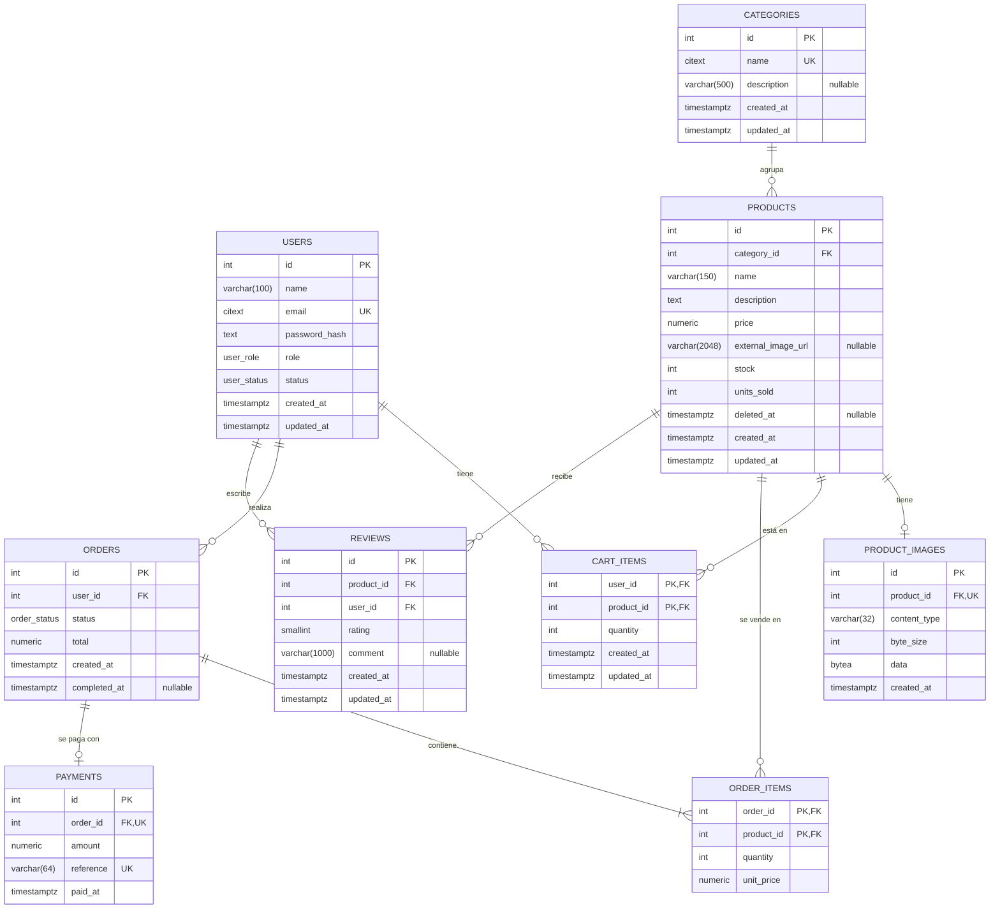

# Base de datos

sistema-e es una tienda en línea: catálogo, carrito, pedidos con pago simulado, reseñas y administración de productos, inventario y usuarios. Todos sus datos viven en una base relacional **PostgreSQL 16**, la única fuente de verdad del sistema.

En la instalación en VMs hay dos nodos:

- un primario, en la VM `data1`;
- una réplica asíncrona en espera, en la VM `data2`.

La replicación y el failover se describen en [infraestructura.md](infraestructura.md).

**Dónde se define el esquema:**

- Se declara con Prisma en [`backend/prisma/schema.prisma`](../backend/prisma/schema.prisma) y se aplica con Prisma Migrate (migraciones en `backend/prisma/migrations/`).
- Lo que Prisma no puede declarar (constraints CHECK y extensiones) se agrega como SQL en esas mismas migraciones.

## 1. Modelo entidad-relación



## 2. Convenciones

| Tema | Convención |
|---|---|
| Llaves primarias | `INTEGER` autoincremental (`SERIAL`). Alcanza para 2.100 millones de filas por tabla |
| Nombres | Tablas, columnas y endpoints en inglés y en snake_case. En Prisma, los modelos van en PascalCase y se mapean con `@@map` y `@map` |
| Fechas | `TIMESTAMPTZ`, generadas por PostgreSQL con `now()`. `updated_at` lo asigna Prisma con `@updatedAt` |
| Montos | `NUMERIC(12,2)`. Prisma los expone como `Decimal`: aritmética exacta, sin errores de punto flotante |
| Email y nombre de categoría | `citext`: la unicidad no distingue mayúsculas de minúsculas |
| Triggers | Ninguno. `updated_at` y `units_sold` los asigna el backend dentro de sus transacciones |

**Tipos enumerados:**

| Tipo | Valores |
|---|---|
| `user_role` | `CUSTOMER`, `ADMIN` |
| `user_status` | `ACTIVE`, `BLOCKED` |
| `order_status` | `PENDING_PAYMENT`, `COMPLETED` |

**Extensiones:** `citext` (texto sin distinción de mayúsculas) y `pg_trgm` (índices de trigramas para la búsqueda). Las crea la migración inicial.

## 3. Tablas y constraints

| Tabla | Descripción | Constraints |
|---|---|---|
| `users` | Clientes y administradores | `email` UNIQUE, de 3 a 254 caracteres · `name` no vacío |
| `categories` | Categorías del catálogo | `name` UNIQUE, no vacío, de hasta 80 caracteres |
| `products` | Productos, con su stock y sus unidades vendidas | FK → `categories` `ON DELETE RESTRICT` · `name` no vacío · `price > 0` · `stock ≥ 0` · `units_sold ≥ 0` · `external_image_url` nulo o que empiece con `https://` |
| `product_images` | Imagen subida de un producto (máximo una) | `product_id` UNIQUE · FK → `products` `ON DELETE CASCADE` · `content_type` ∈ {`image/jpeg`, `image/png`, `image/webp`} · `byte_size` entre 1 byte y 2 MiB e igual a `octet_length(data)` |
| `cart_items` | Carrito: un renglón por cliente y producto | PK (`user_id`, `product_id`) · FKs `ON DELETE CASCADE` · `quantity > 0` |
| `orders` | Pedidos | FK → `users` `ON DELETE RESTRICT` · `total > 0` · `(status = 'COMPLETED') = (completed_at IS NOT NULL)` |
| `order_items` | Detalle del pedido | PK (`order_id`, `product_id`) · FK → `orders` `CASCADE` · FK → `products` `RESTRICT` · `quantity > 0` · `unit_price > 0` |
| `payments` | Pago simulado de un pedido | `order_id` UNIQUE (impide pagar dos veces) · `reference` UNIQUE · `amount > 0` |
| `reviews` | Reseña de un cliente sobre un producto | UNIQUE (`user_id`, `product_id`): una por cliente y producto · FKs → `users` y `products` `RESTRICT` · `rating` entre 1 y 5 · `comment` nulo o no vacío |

**Dónde se declara cada constraint:**

- **En `schema.prisma`:** llaves primarias, FKs, UNIQUE y enums.
- **Como SQL en las migraciones:** los 20 CHECK.
  - 18 están en `20260930000000_init/migration.sql` y 2 en `20260930120000_reviews/migration.sql`.
  - Prisma no gestiona estos CHECK, así que tampoco los elimina en migraciones posteriores.

Ejemplos:

```sql
ALTER TABLE "products" ADD CONSTRAINT "products_stock_non_negative" CHECK ("stock" >= 0);
ALTER TABLE "orders" ADD CONSTRAINT "orders_completed_at_matches_status"
    CHECK (("status" = 'COMPLETED') = ("completed_at" IS NOT NULL));
ALTER TABLE "reviews" ADD CONSTRAINT "reviews_rating_range" CHECK ("rating" BETWEEN 1 AND 5);
```

**Los constraints son la última defensa ante bugs o condiciones de carrera, no la regla de negocio:**

- El backend valida y produce el mensaje de error para el usuario.
- La base impide los estados imposibles.

## 4. Índices

Además de los que crean las PK y los UNIQUE:

| Índice | Consulta que sirve |
|---|---|
| `products (category_id)` | Filtrar por categoría; verificar la FK al borrar una categoría |
| `products (price)` | Filtrar por rango de precio |
| `products (units_sold DESC, id DESC)` | Ordenar por popularidad con una paginación estable |
| GIN `gin_trgm_ops` en `products.name` y en `products.description` | Búsqueda con `ILIKE '%texto%'` |
| `orders (user_id, created_at DESC)` | Historial de pedidos de un cliente |
| `reviews (product_id, created_at DESC)` | Reseñas de un producto, las más recientes primero |
| `cart_items (product_id)`, `order_items (product_id)` | FKs (PostgreSQL no las indexa automáticamente) |

- **Declaración:** todos se declaran en `schema.prisma`; los GIN, con `type: Gin` y `gin_trgm_ops`.
- **Imagen en los listados:** se hace `LEFT JOIN product_images` usando el UNIQUE de `product_id` y se selecciona solo `id`, nunca `data`.
- **Paginación:** offset + `COUNT(*)`, porque la interfaz muestra números de página y el total.
- **Verificación:** con pocas filas, PostgreSQL prefiere recorrer la tabla completa. Para demostrar que los índices se usan, se cargan los datos de demostración (§9) y se ejecuta `EXPLAIN ANALYZE`. Por ejemplo, en el primario:

  ```sql
  EXPLAIN ANALYZE SELECT id FROM products WHERE name ILIKE '%lámpara%' AND deleted_at IS NULL LIMIT 20;
  EXPLAIN ANALYZE SELECT id FROM products WHERE deleted_at IS NULL ORDER BY units_sold DESC, id DESC LIMIT 20;
  ```

## 5. Normalización

El modelo está en tercera forma normal, salvo dos desnormalizaciones justificadas. Otros dos datos parecen redundantes, pero no lo son:

| Dato | ¿Desnormalizado? | Justificación |
|---|---|---|
| `order_items.unit_price` | No | Es un hecho histórico: el precio al comprar no es el precio actual |
| `payments.amount` | No | Es el monto efectivamente cobrado |
| `orders.total` | Sí, se deriva de los ítems | Es inmutable: los ítems no cambian después de crear el pedido, así que no puede haber anomalías de actualización |
| `products.units_sold` | Sí, se deriva de `order_items` | Se actualiza en la misma transacción que descuenta el stock. Hace falta para poder indexar la popularidad |

La calificación promedio de un producto **no** se guarda: se calcula en cada consulta con `AVG` y `COUNT` sobre `reviews`.

## 6. Otras decisiones del modelo

- **Sin tabla `carts`:** el carrito es el conjunto de `cart_items` del cliente. Vive en PostgreSQL y no en Redis porque son datos de negocio con integridad referencial.
- **Imágenes subidas en PostgreSQL:**
  - Se replican junto con los datos.
  - Se actualizan en la misma transacción que el producto, así que no quedan archivos huérfanos.
  - No hace falta almacenamiento compartido entre VMs.

  El costo de servirlas desde la base se mitiga con caché HTTP inmutable y con la caché en disco de NGINX.
- **Una sola imagen por producto:** la externa o la subida. Al asignar una, el backend elimina la otra en la misma transacción.
- **Borrado lógico de productos:**
  - Al eliminar un producto se marca `deleted_at`, se quita de los carritos en la misma transacción y deja de aparecer en el catálogo.
  - Un borrado físico rompería los pedidos y las reseñas históricos.
  - Una categoría con productos, incluso eliminados, no se puede borrar.
- **El stock vive en `products`:** evita un join para ordenar por popularidad. El costo es que cada compra reescribe la fila y sus índices, lo que es irrelevante a esta escala.
- **Llaves secuenciales:** las genera la base, así que son únicas aunque haya varias instancias de la API. Tras un failover, las secuencias pueden saltar hasta 32 valores: puede haber huecos, nunca duplicados.
- **Reseñas con `RESTRICT`:** un usuario o un producto con reseñas no se puede borrar físicamente. El sistema nunca lo hace: los productos se borran de forma lógica y los usuarios se bloquean.

## 7. Transacciones

| Operación | Qué hace en una sola transacción |
|---|---|
| Agregar al carrito | UPSERT que suma la cantidad, verificación contra el stock y, si no alcanza, `ROLLBACK` (409) |
| Crear pedido (`POST /orders`) | Bloquea el carrito del cliente, valida que los productos sigan activos y con stock, inserta `orders` (`PENDING_PAYMENT`) y `order_items` con el precio congelado y quita del carrito esos productos. **No toca el inventario** |
| Pagar (`POST /orders/{id}/payment`) | `SELECT … FOR UPDATE` del pedido y de sus productos en orden de id, revalidación del stock, pago simulado, `INSERT payments`, descuento de `stock`, suma de `units_sold` y paso a `COMPLETED`. Cualquier error hace `ROLLBACK` |
| Subir imagen | Borra la imagen anterior, inserta la nueva y limpia `external_image_url` |
| Eliminar producto | Marca `deleted_at` y lo quita de los carritos |

El **ajuste de inventario** no necesita transacción: es un único `UPDATE` condicional (`stock = stock + n` solo si el resultado no queda negativo), así que no pisa una venta concurrente. Si no actualiza ninguna fila, responde 409.

- **Aislamiento:** `READ COMMITTED` más locks de fila.
- **`withTransaction`:** envuelve `prisma.$transaction(fn, { isolationLevel: 'ReadCommitted', maxWait: 2000, timeout: 10000 })`. El `timeout` de Prisma (10 s) es mayor que el `lock_timeout` de PostgreSQL (5 s), para que el error que llegue sea el de PostgreSQL.
- **SQL crudo:** solo `$queryRaw` / `$executeRaw` con tagged templates, que parametrizan los valores. Se usa para:
  - los `SELECT … FOR UPDATE`;
  - el `INSERT … ON CONFLICT` de las reseñas;
  - la carga de los datos de demostración.

El flujo completo del pago, con sus garantías de concurrencia, está en [arquitectura.md §8](arquitectura.md#8-flujos-críticos).

## 8. Roles de base de datos

| Rol | Uso | Permisos |
|---|---|---|
| `ecommerce_owner` | Migraciones | Dueño de la base `ecommerce` y del esquema. Crea las extensiones |
| `ecommerce_app` | API | Solo `SELECT`, `INSERT`, `UPDATE` y `DELETE`. No puede crear, alterar ni borrar tablas |
| `replicator` | Replicación física hacia la réplica | Solo el atributo `REPLICATION` |

**Timeouts del rol `ecommerce_app`:**

| Parámetro | Valor | Efecto |
|---|---|---|
| `lock_timeout` | 5 s | Quien espera un lock falla rápido (503) en vez de colgarse |
| `statement_timeout` | 15 s | Ninguna consulta monopoliza la base |
| `idle_in_transaction_session_timeout` | 10 s | Si una instancia se congela con una transacción abierta, PostgreSQL cierra su sesión y libera sus locks |

Estos parámetros se guardan en el catálogo de PostgreSQL, así que se replican y siguen vigentes después de un failover.

La creación de los roles (`deploy/db/postgresql/roles.sql`), `pg_hba.conf` y la replicación están en [infraestructura.md §7](infraestructura.md#7-postgresql-data1-y-data2).

## 9. Datos de demostración

El script `backend/scripts/seed-demo.ts` carga volumen para mostrar el catálogo y la paginación, y para verificar los índices:

- **Qué carga:** con SQL (`generate_series`) y en una sola transacción, genera 50.000 productos, 2.000 clientes, unos 20.000 pedidos completados con sus `order_items` y `payments`, y reseñas.
- **Coherencia:** `units_sold` se calcula a partir de los `order_items` generados, no se inventa. Las ventas se concentran en pocos productos, para que el orden por popularidad sea visible.
- **Precondición:** el script se niega a correr si ya hay productos.
- **Naturaleza:** es una herramienta de demostración, no una funcionalidad del sistema.

El detalle de los datos (incluidas las credenciales de los clientes de demostración) y cómo ejecutarlo están en [guia-tecnica.md §6](guia-tecnica.md#6-cargar-los-datos-de-demostración).
