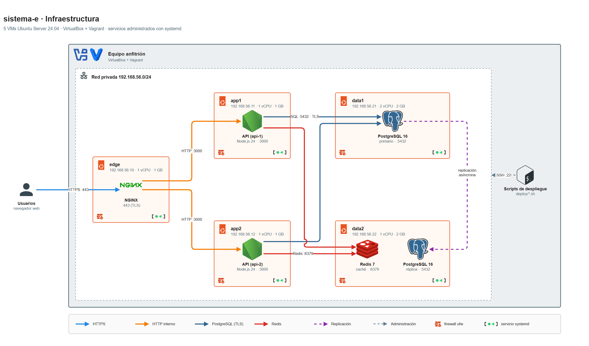

# Infraestructura

sistema-e es una tienda en línea formada por:

- una SPA en React;
- una API REST en Node.js, que corre en dos instancias;
- PostgreSQL, con un primario y una réplica;
- Redis como caché;
- NGINX como único punto de entrada.

Este documento describe cómo se despliega: las máquinas virtuales, la red, la configuración de cada servicio y cómo se comporta el sistema ante fallos. Todo usa servicios nativos de Linux administrados con **systemd**.

Toda la configuración la instalan los scripts de [`deploy/`](../deploy). Los fragmentos de este documento son los archivos tal como quedan instalados, con las IPs de [`deploy/cluster.env`](../deploy/cluster.env). Los pasos para levantar el sistema están en [guia-tecnica.md](guia-tecnica.md).

Este documento es la **referencia** de la configuración. Cómo funciona cada pieza y por qué se eligió así está explicado en [infraestructura-explicada.md](infraestructura-explicada.md).

## 1. Diagrama de infraestructura



Fuente editable: [diagramas/infraestructura.drawio](diagramas/infraestructura.drawio). Se abre con [draw.io](https://app.diagrams.net).

## 2. Topología

Cinco VMs Ubuntu Server 24.04, creadas con Vagrant (box `bento/ubuntu-24.04`) sobre VirtualBox, en una red privada con IPs fijas:

| VM | Rol | Servicios (unidad systemd) | IP privada | Recursos |
|---|---|---|---|---|
| `edge` | Entrada | NGINX (`nginx`) | 192.168.56.10 | 1 vCPU · 1 GB |
| `app1` | Backend | API (`ecommerce-api@3000`, `INSTANCE_ID=api-1`) | 192.168.56.11 | 1 vCPU · 1 GB |
| `app2` | Backend | API (`ecommerce-api@3000`, `INSTANCE_ID=api-2`) | 192.168.56.12 | 1 vCPU · 1 GB |
| `data1` | Base de datos | PostgreSQL 16 primario (`postgresql@16-main`) | 192.168.56.21 | 2 vCPU · 2 GB |
| `data2` | Base de datos y caché | PostgreSQL 16 réplica en espera (`postgresql@16-main`) · Redis 7 (`redis-server`) | 192.168.56.22 | 1 vCPU · 2 GB |

- **Memoria:** las VMs suman 7 GB. Se recomiendan 16 GB en el equipo anfitrión.
- **Configuración del despliegue:**
  - [`deploy/cluster.env`](../deploy/cluster.env) define las IPs, las versiones y `CURRENT_PRIMARY`, el nodo que hoy es el primario de PostgreSQL. `failover.sh` actualiza ese valor.
  - Los secretos van en `deploy/secrets.env`, que no se versiona.
- **Roles de los nodos de base de datos:** el `Vagrantfile` asigna el rol de cada nodo según `CURRENT_PRIMARY` y aprovisiona primero al primario, porque la réplica se inicializa copiándolo.
- **Interfaces de red:**
  - Vagrant agrega a cada VM una interfaz NAT, que sirve para la salida a internet (instalar paquetes) y para la entrada de `vagrant ssh`.
  - Los servicios escuchan **solo** en la interfaz privada `192.168.56.0/24`.
- **Arranque con la red lista:** PostgreSQL, Redis y la API escuchan en la IP privada, que aparece durante el arranque. Por eso:
  - arrancan después de `network-online.target`;
  - `net.ipv4.ip_nonlocal_bind = 1` les permite enlazar esa IP aunque la interfaz todavía no esté configurada.
- **Relojes:** NTP activo en todas las VMs (`timedatectl set-ntp true`), para que la expiración del JWT y la correlación de logs sean consistentes.

## 3. Red y firewall

Todas las VMs usan `ufw`, con todo lo entrante denegado por defecto:

| VM | Puerto | Solo desde |
|---|---|---|
| `edge` | 80, 443 | Cualquiera |
| `app1`, `app2` | 3000 | `edge` |
| `data1`, `data2` | 5432 | `app1`, `app2` y el otro nodo de base de datos (replicación) |
| `data2` | 6379 | `app1`, `app2` |
| Todas | 22 | Cualquiera |

- **SSH:** `vagrant ssh` entra por la interfaz NAT de VirtualBox, no por la red privada. SSH usa la llave que Vagrant genera para cada VM.
- **Nodos de base de datos intercambiables:** los dos tienen las mismas reglas, así que cualquiera puede ser primario sin tocar el firewall.

Reglas de `app1`, por ejemplo:

```bash
ufw default deny incoming
ufw default allow outgoing
ufw allow 22/tcp
ufw allow from 192.168.56.10 to any port 3000 proto tcp
ufw --force enable
```

## 4. Seguridad entre VMs y secretos

- **TLS:** termina en NGINX. De NGINX a la API el tráfico va por HTTP, dentro de la red privada y restringido por el firewall.
- **PostgreSQL:**
  - Todas las conexiones remotas, incluida la replicación, usan `hostssl` con `scram-sha-256`.
  - El certificado del servidor es el autofirmado que trae Ubuntu (`ssl-cert`).
  - La API usa `DB_SSL_MODE=require`: la conexión va cifrada, sin verificar ese certificado.
- **Redis:** tiene contraseña de administración, y la API usa un usuario ACL propio, `ecommerce_app`.
- **Secretos:** `deploy/secrets.env` se genera en el anfitrión con `deploy/init-secrets.sh` y nunca se versiona. `deploy/secrets.env.example` es la plantilla sin valores.

Cada servicio recibe en su configuración solo los secretos que necesita:

| VM | Archivo | Secretos |
|---|---|---|
| `edge` | `/etc/nginx/tls/ecommerce.key` y `/etc/nginx/tls/ca/ca.key` (0600) | Claves privadas del sitio y de la CA local, generadas en la VM. Nunca salen de `edge` |
| `app1`, `app2` | `/etc/ecommerce/ecommerce.env` (0640, `root:ecommerce`) | `JWT_SECRET` y las contraseñas de `ecommerce_app` en PostgreSQL y en Redis |
| `app1`, `app2` | `/etc/ecommerce/migrate.env` (0600, `root`) | Contraseña de `ecommerce_owner`, que solo se usa para migrar. El servicio de la API no puede leerla |
| `data1`, `data2` | Catálogo de PostgreSQL y `~postgres/.pgpass` (0600) | Contraseñas de los roles y de `replicator` |
| `data2` | `/etc/redis/users.acl` (0640) | SHA-256 de las contraseñas de Redis, nunca en texto plano |

## 5. NGINX (`edge`)

`deploy/edge/install-edge.sh` instala los archivos de `deploy/edge/nginx/`. La plantilla del sitio se completa con las IPs de `cluster.env`.

### Sitio: `/etc/nginx/sites-available/ecommerce`

```nginx
upstream ecommerce_api {
    server 192.168.56.11:3000 max_fails=2 fail_timeout=10s;
    server 192.168.56.12:3000 max_fails=2 fail_timeout=10s;
    keepalive 16;
}

proxy_cache_path /var/cache/nginx/images levels=1:2 keys_zone=images:10m
                 max_size=500m inactive=30d use_temp_path=off;

server {
    listen 80 default_server;
    server_name _;
    return 301 https://$host$request_uri;
}

server {
    listen 443 ssl http2 default_server;
    server_name _;

    ssl_certificate     /etc/nginx/tls/ecommerce.crt;
    ssl_certificate_key /etc/nginx/tls/ecommerce.key;
    ssl_protocols       TLSv1.2 TLSv1.3;
    ssl_session_cache   shared:ecommerce_ssl:10m;
    ssl_session_timeout 1d;

    client_max_body_size 3m;
    access_log /var/log/nginx/ecommerce.access.log ecommerce;
    root /var/www/ecommerce;

    location ~ /\. {
        deny all;
    }

    location /api/v1/images/ {
        include snippets/ecommerce-proxy.conf;
        proxy_cache images;
        proxy_cache_valid 200 30d;
        proxy_cache_lock on;
        add_header X-Cache-Status $upstream_cache_status always;
    }

    # Las cabeceras de seguridad de la API las pone la propia API (helmet).
    location /api/ {
        include snippets/ecommerce-proxy.conf;
    }

    location /assets/ {
        include snippets/ecommerce-headers.conf;
        add_header Cache-Control "public, max-age=31536000, immutable" always;
        try_files $uri =404;
    }

    location = /index.html {
        include snippets/ecommerce-headers.conf;
        add_header Cache-Control "no-cache" always;
    }

    location / {
        include snippets/ecommerce-headers.conf;
        add_header Cache-Control "no-cache" always;
        try_files $uri /index.html;
    }
}
```

### Contexto `http`: `/etc/nginx/conf.d/ecommerce-global.conf`

```nginx
server_tokens off;

log_format ecommerce '$remote_addr [$time_local] "$request" $status $body_bytes_sent '
                     'rt=$request_time upstream=$upstream_addr upstream_status=$upstream_status '
                     'rid=$request_id';

gzip_types text/css application/javascript application/json image/svg+xml;
```

### Proxy hacia la API: `/etc/nginx/snippets/ecommerce-proxy.conf`

```nginx
proxy_pass http://ecommerce_api;
proxy_http_version 1.1;
proxy_set_header Connection "";
proxy_set_header Host $host;
proxy_set_header X-Request-ID $request_id;
proxy_set_header X-Real-IP $remote_addr;
proxy_set_header X-Forwarded-For $proxy_add_x_forwarded_for;
proxy_set_header X-Forwarded-Proto $scheme;

proxy_connect_timeout 2s;
proxy_send_timeout 10s;
proxy_read_timeout 10s;

# Solo fallas de la instancia. Un 503 de la API (base caída) no la marca como caída.
# Un POST o PATCH que ya llegó a un backend no se reintenta (comportamiento por defecto).
proxy_next_upstream error timeout;
proxy_next_upstream_tries 2;
proxy_next_upstream_timeout 15s;
```

### Cabeceras de la SPA: `/etc/nginx/snippets/ecommerce-headers.conf`

```nginx
add_header Content-Security-Policy "default-src 'self'; script-src 'self'; style-src 'self'; img-src 'self' https: data:; connect-src 'self'; font-src 'self'; object-src 'none'; base-uri 'self'; form-action 'self'; frame-ancestors 'none'" always;
add_header X-Content-Type-Options "nosniff" always;
add_header Referrer-Policy "strict-origin-when-cross-origin" always;
add_header X-Frame-Options "DENY" always;
```

### Comportamiento

- **Balanceo:** round-robin, el método por defecto del `upstream`. `keepalive 16` reutiliza conexiones hacia la API.
- **Detección de una instancia caída:**
  - Si la conexión se rechaza o no se establece en 2 s, NGINX reintenta la request en la otra instancia (`proxy_next_upstream error timeout`, como máximo 2 intentos).
  - Tras 2 fallos, la instancia sale del reparto durante 10 s (`max_fails=2 fail_timeout=10s`). Después, NGINX la vuelve a probar.
- **Reintentos seguros:** un `POST` o `PATCH` que ya llegó a un backend nunca se reenvía. Es el comportamiento por defecto de NGINX (no se usa `non_idempotent`), y garantiza que una compra no se ejecute dos veces por un reintento.
- **Sin `http_503` en los reintentos:** la API responde 503 cuando la base no está disponible. Si NGINX contara esos 503 como fallas, con la base caída marcaría las dos instancias como caídas y respondería 502, en lugar del JSON 503 de la API.
- **Cabeceras:**
  - En NGINX, un `add_header` dentro de un `location` anula todos los del nivel superior. Por eso las cabeceras de la SPA están en un fragmento que incluye cada `location`.
  - `/api/` no lo incluye: la API envía sus propias cabeceras con helmet, y Swagger UI (`/api/docs`) necesita su propia CSP.
- **Caché de imágenes:**
  - `/api/v1/images/` pasa por la API solo la primera vez. Después, la imagen sale de la caché en disco de NGINX.
  - El header `X-Cache-Status` (`MISS` o `HIT`) muestra de dónde salió. Esa caché es desechable.
- **SPA:**
  - `index.html` se sirve con `no-cache`, así que una versión nueva se ve al recargar.
  - Los archivos de `/assets/` llevan un hash en el nombre y se sirven como `immutable`.
  - Cualquier otra ruta devuelve `index.html`, para que funcione el enrutamiento del navegador.
- **Log de acceso:** `/var/log/nginx/ecommerce.access.log`. Incluye la instancia que atendió (`upstream`) y el `X-Request-ID` (`rid`).

### HTTPS

`install-edge.sh` crea una CA local y firma con ella el certificado de NGINX. Un certificado autofirmado cifra igual, pero el navegador lo marca como inseguro porque no lo respalda ninguna entidad de confianza. Con la CA local basta importarla una vez en el equipo que abre el sitio.

1. **CA local** (`/etc/nginx/tls/ca/`, se crea una sola vez, 10 años):

   ```bash
   openssl req -x509 -newkey rsa:3072 -nodes -sha256 -days 3650 \
     -subj "/CN=Sistema E - CA local" \
     -addext "basicConstraints=critical,CA:TRUE,pathlen:0" \
     -addext "keyUsage=critical,keyCertSign,cRLSign" \
     -addext "nameConstraints=critical,permitted;IP:192.168.56.10/255.255.255.255,permitted;DNS:sistema-e.local" \
     -keyout /etc/nginx/tls/ca/ca.key -out /etc/nginx/tls/ca/ca.crt
   ```

   `nameConstraints` limita la CA a la IP de `edge` y a `sistema-e.local`: aunque se instale como raíz de confianza, no puede validar certificados de otros sitios.
2. **Certificado del sitio** (`/etc/nginx/tls/ecommerce.crt`, 397 días): firmado por la CA, con `subjectAltName=IP:192.168.56.10,DNS:sistema-e.local` y uso `serverAuth`. Se reemite al aprovisionar si falta, si no lo firmó la CA actual, si no cubre `EDGE_IP` o si vence en menos de 30 días.
3. **Parte pública de la CA:** se copia a `.release/tls/sistema-e-ca.crt` (carpeta del repositorio, no versionada). La clave privada no sale de `edge`.
4. **Comprobación:** al final, `install-edge.sh` se conecta a `/api/v1/health` validando contra la CA (sin `-k`) y muestra la huella SHA-256 de la CA.

**Importar la CA en Windows** (usuario actual, sin permisos de administrador), desde la raíz del repositorio:

```powershell
Import-Certificate -FilePath .release\tls\sistema-e-ca.crt -CertStoreLocation Cert:\CurrentUser\Root
```

Windows pide confirmar: la huella debe coincidir con la que mostró `install-edge.sh`. Después hay que cerrar y volver a abrir el navegador. Para quitarla: `certmgr.msc` → «Entidades de certificación raíz de confianza» → «Sistema E - CA local».

- **Nombre con que se entra:** `https://192.168.56.10` o `https://sistema-e.local` (este último requiere una entrada en el archivo `hosts`). Con otro nombre el certificado no coincide.
- **Si se destruye `edge`:** se crea una CA nueva y hay que volver a importarla.
- **HSTS:** no se activa. La CA solo es de confianza en los equipos donde se importó; en cualquier otro, HSTS impediría aceptar la advertencia.
- **Dominio público:** con un dominio real, el certificado se reemplaza por uno de Let's Encrypt (`certbot --nginx -d <dominio>`) y se puede activar HSTS.

## 6. systemd

### API (`app1` y `app2`)

`ecommerce-api@.service` es una unidad plantilla: `%i` es el puerto. Cada VM de aplicación levanta `ecommerce-api@3000`.

```ini
# /etc/systemd/system/ecommerce-api@.service   (fuente: deploy/app/ecommerce-api@.service)
[Unit]
Description=Sistema E - API (puerto %i)
After=network-online.target
Wants=network-online.target
StartLimitIntervalSec=60
StartLimitBurst=10

[Service]
Type=simple
User=ecommerce
Group=ecommerce
WorkingDirectory=/opt/ecommerce/src/backend
EnvironmentFile=/etc/ecommerce/ecommerce.env
Environment=PORT=%i
ExecStart=/usr/bin/node dist/server.js
Restart=always
RestartSec=2
KillSignal=SIGTERM
TimeoutStopSec=15

UMask=0077
NoNewPrivileges=true
ProtectSystem=strict
ProtectHome=true
PrivateTmp=true
PrivateDevices=true
ProtectKernelTunables=true
ProtectKernelModules=true
ProtectKernelLogs=true
ProtectControlGroups=true
ProtectClock=true
ProtectHostname=true
RestrictAddressFamilies=AF_INET AF_INET6 AF_UNIX
RestrictNamespaces=true
RestrictRealtime=true
RestrictSUIDSGID=true
RemoveIPC=true
CapabilityBoundingSet=
LockPersonality=true
SystemCallArchitectures=native
SystemCallFilter=@system-service
SystemCallFilter=~@privileged
SystemCallErrorNumber=EPERM

[Install]
WantedBy=multi-user.target
```

- **Usuario:** `ecommerce` es un usuario de sistema sin shell (`/usr/sbin/nologin`).
- **Reinicio automático:** `Restart=always` reinicia el proceso a los 2 s si muere. `StartLimitBurst` evita un bucle infinito si la API falla al arrancar (más de 10 intentos en 60 s).
- **Apagado ordenado:** ante `systemctl stop` o `restart`, systemd envía `SIGTERM`, y la API termina las requests en curso antes de salir. `TimeoutStopSec=15` le da margen.
- **Endurecimiento:**
  - El proceso no puede escalar privilegios, ve el sistema de archivos en solo lectura, no ve los directorios personales y solo puede usar las llamadas al sistema de un servicio común.
  - No se usa `MemoryDenyWriteExecute`, porque el compilador JIT de V8 necesita memoria escribible y ejecutable.
  - Se revisa con `systemd-analyze security ecommerce-api@3000`.
- **Actualización de la unidad:** se reinstala en cada publicación (`deploy-app.sh`), así un cambio de endurecimiento llega con `release.sh`.
- **Cuelgues:** systemd reinicia el proceso si muere, pero no detecta que se colgó; no hay watchdog.

### Variables de entorno: `/etc/ecommerce/ecommerce.env`

Las escribe `install-app.sh`. El backend las valida con Zod al arrancar ([`backend/src/config/env.ts`](../backend/src/config/env.ts)) y termina con un mensaje claro si falta alguna, sin mostrar sus valores.

| Variable | Valor en `app1` | Descripción |
|---|---|---|
| `NODE_ENV` | `production` | |
| `HOST` | `192.168.56.11` | La API escucha solo en la IP privada de su VM |
| `INSTANCE_ID` | `api-1` | Identifica la instancia en los logs y en `GET /health` |
| `LOG_LEVEL` | `info` | Nivel de pino |
| `TRUST_PROXY` | `192.168.56.10` | `trust proxy` de Express: solo se confía en los `X-Forwarded-*` que envía `edge` |
| `DATABASE_URL` | `postgresql://ecommerce_app:<secreto>@192.168.56.21:5432/ecommerce` | Rol de la aplicación contra el primario actual. `failover.sh` cambia el host |
| `DB_SSL_MODE` | `require` | Conexión cifrada a PostgreSQL, sin verificar el certificado autofirmado |
| `DB_POOL_MAX` | `10` | Tamaño del pool de conexiones por instancia |
| `REDIS_URL` | `redis://ecommerce_app:<secreto>@192.168.56.22:6379/0` | Usuario ACL de la API |
| `JWT_SECRET` | `<secreto>` | Firma de las sesiones; al menos 32 caracteres |
| `JWT_EXPIRES_IN` | `7200` | Duración de la sesión, en segundos |
| `COOKIE_SECURE` | `true` | La cookie de sesión solo viaja por HTTPS |

`PORT` lo fija la unidad (`Environment=PORT=%i`).

`MIGRATE_DATABASE_URL`, con el rol `ecommerce_owner`, no está en este archivo: vive en `/etc/ecommerce/migrate.env` y solo la usa Prisma CLI al migrar.

### NGINX, PostgreSQL y Redis

Traen su propia unidad. A cada una se le agrega un drop-in que agrega el reinicio automático y el arranque con la red lista:

```ini
# /etc/systemd/system/nginx.service.d/10-ecommerce.conf               (edge)
# /etc/systemd/system/postgresql@16-main.service.d/10-ecommerce.conf  (data1, data2)
# /etc/systemd/system/redis-server.service.d/10-ecommerce.conf        (data2)
[Unit]
After=network-online.target
Wants=network-online.target

[Service]
Restart=always
RestartSec=2
```

### Comandos útiles

```bash
systemctl status ecommerce-api@3000
journalctl -u ecommerce-api@3000 -f               # logs JSON de la API
journalctl -u ecommerce-api@3000 | grep <X-Request-ID>
systemctl show -p NRestarts ecommerce-api@3000    # cuántas veces la reinició systemd
systemctl cat postgresql@16-main                  # unidad + drop-ins efectivos
```

## 7. PostgreSQL (`data1` y `data2`)

`deploy/db/install-db.sh primary|standby` instala PostgreSQL 16 de los repositorios de Ubuntu. Los dos nodos quedan con la misma configuración, así que cualquiera puede ser primario.

### Configuración del servidor: `/etc/postgresql/16/main/conf.d/10-ecommerce.conf`

```ini
listen_addresses = 'localhost,192.168.56.21'   # en data2: 'localhost,192.168.56.22'
password_encryption = scram-sha-256
ssl = on
wal_level = replica
max_wal_senders = 10
max_replication_slots = 10
max_slot_wal_keep_size = 1GB
hot_standby = on
```

- **Conexiones:** `max_connections` queda en su valor por defecto, 100. Las dos instancias de la API usan como máximo 20 (2 × pool de 10).
- **WAL retenido:** `max_slot_wal_keep_size = 1GB` evita que una réplica desconectada llene el disco del primario.

### Autenticación de clientes: `/etc/postgresql/16/main/pg_hba.conf`

Idéntico en ambos nodos (fuente: `deploy/db/postgresql/pg_hba.conf.tpl`):

```
# TYPE   DATABASE     USER                            ADDRESS             METHOD
local    all          postgres                                            peer
local    all          all                                                 peer
host     all          all                             127.0.0.1/32        scram-sha-256
host     all          all                             ::1/128             scram-sha-256

hostssl  ecommerce    ecommerce_app,ecommerce_owner   192.168.56.11/32    scram-sha-256
hostssl  ecommerce    ecommerce_app,ecommerce_owner   192.168.56.12/32    scram-sha-256

hostssl  replication  replicator                      192.168.56.21/32    scram-sha-256
hostssl  replication  replicator                      192.168.56.22/32    scram-sha-256
```

### Roles y permisos

[`deploy/db/postgresql/roles.sql`](../deploy/db/postgresql/roles.sql) es idempotente. Se ejecuta como superusuario y lee las contraseñas de variables de entorno (`\getenv`), para que no aparezcan en la lista de procesos:

```bash
DB_OWNER_PASSWORD=… DB_APP_PASSWORD=… psql -v ON_ERROR_STOP=1 -d postgres -f roles.sql
```

Qué hace:

- **Roles:** crea, si no existen, `ecommerce_owner` y `ecommerce_app`, sin superusuario, sin `CREATEDB` y sin `CREATEROLE`, y les asigna su contraseña.
- **Timeouts de `ecommerce_app`:** `idle_in_transaction_session_timeout = 10s`, `lock_timeout = 5s` y `statement_timeout = 15s`.
- **Base:** crea la base `ecommerce` (UTF-8) con dueño `ecommerce_owner`.
- **Permisos sobre la base y el esquema:** revoca los de `PUBLIC` sobre la base y el esquema `public`. `ecommerce_app` solo recibe `CONNECT` y `USAGE`.
- **Permisos sobre los objetos:** da a `ecommerce_app` `SELECT`, `INSERT`, `UPDATE` y `DELETE` sobre las tablas, y `USAGE, SELECT` sobre las secuencias.
  - Lo hace para los objetos existentes.
  - Con `ALTER DEFAULT PRIVILEGES FOR ROLE ecommerce_owner`, también para los que creen las migraciones futuras.

El rol `replicator` (`LOGIN REPLICATION`) lo crea `install-db.sh` en el primario, porque solo existe en las VMs.

| Rol | Uso | Permisos |
|---|---|---|
| `ecommerce_owner` | Migraciones (`prisma migrate deploy`) | Dueño de la base y del esquema; crea las extensiones `pg_trgm` y `citext` |
| `ecommerce_app` | API | Solo DML. No puede crear, alterar ni borrar tablas |
| `replicator` | Replicación | Solo el atributo `REPLICATION` |

### Replicación

Es física, por streaming y asíncrona.

1. **Slot de replicación:** el primario crea un slot para el otro nodo (`data2_slot` cuando el primario es `data1`). El slot retiene el WAL que la réplica todavía no recibió.
2. **Creación de la réplica:** `install-db.sh standby` la crea copiando el primario:

   ```bash
   systemctl stop postgresql@16-main
   rm -rf /var/lib/postgresql/16/main
   sudo -u postgres pg_basebackup \
     -d "host=192.168.56.21 user=replicator sslmode=require" \
     -D /var/lib/postgresql/16/main -R -S data2_slot -X stream --checkpoint=fast
   systemctl start postgresql@16-main
   ```

   `-R` genera `standby.signal` y la conexión al primario (`primary_conninfo`, `primary_slot_name`).
3. **Contraseña de `replicator`:** vive en `~postgres/.pgpass` (0600), nunca en la línea de comandos.
4. **Protecciones:**
   - Si el nodo ya es réplica, el script conserva sus datos.
   - Se niega a borrar un nodo que sea primario y tenga la base del sistema; para eso está `rebuild-standby.sh`.
   - `install-db.sh primary` se niega a correr en un nodo que no sea `CURRENT_PRIMARY`. Así, volver a aprovisionar nunca revive un primario viejo.

### Monitoreo

```sql
-- En el primario: estado y retraso de la réplica
SELECT client_addr, state, sync_state, write_lag, replay_lag FROM pg_stat_replication;
SELECT slot_name, active FROM pg_replication_slots;

-- En la réplica: confirma que está en recuperación y cuánto atraso tiene
SELECT pg_is_in_recovery(), now() - pg_last_xact_replay_timestamp() AS retraso;
```

`deploy/db/db-node.sh status` muestra lo mismo según el rol del nodo.

## 8. Redis (`data2`)

`deploy/cache/install-cache.sh` instala Redis de los repositorios de Ubuntu y agrega al final de `/etc/redis/redis.conf` la línea `include /etc/redis/ecommerce.conf`:

```ini
# /etc/redis/ecommerce.conf
bind 192.168.56.22 127.0.0.1
protected-mode yes
port 6379
aclfile /etc/redis/users.acl
save ""
appendonly no
maxmemory 256mb
maxmemory-policy allkeys-lru
supervised systemd
```

- **Sin persistencia** (`save ""`, `appendonly no`): Redis es solo una caché.
- **Memoria:** `maxmemory` es un valor de referencia para una VM de 2 GB compartida con la réplica de PostgreSQL. Al llenarse, Redis descarta las claves menos usadas.

**Usuarios** (`/etc/redis/users.acl`, a partir de la plantilla [`deploy/cache/redis/users.acl.tpl`](../deploy/cache/redis/users.acl.tpl)):

```
user default on #<sha256 de REDIS_ADMIN_PASSWORD> ~* &* +@all
user ecommerce_app on #<sha256 de REDIS_APP_PASSWORD> ~catalog:* resetchannels +@all -@dangerous
```

- **Permisos de la API:** solo puede tocar las claves `catalog:*` y no puede ejecutar comandos `@dangerous` (`FLUSHALL`, `CONFIG`, `KEYS`…).
- **Cliente ioredis:** usa `commandTimeout: 200` y `enableOfflineQueue: false`. Si Redis cae, los comandos fallan de inmediato y la API lee de PostgreSQL, en vez de quedar esperando.

Verificación, desde `data2`:

```bash
redis-cli --user ecommerce_app --askpass PING           # PONG
redis-cli --user ecommerce_app --askpass GET catalog:version
redis-cli --user ecommerce_app --askpass FLUSHALL       # NOPERM
```

## 9. Failover y reconstrucción

### `deploy/failover.sh` (manual)

Se ejecuta en el anfitrión. El trabajo en cada VM lo hacen `deploy/db/db-node.sh` y `deploy/app/repoint-db.sh`.

1. **Verifica** que el otro nodo sea una réplica activa y muestra su retraso. Si no lo es, se detiene. Así, repetir un failover a medias no promueve al primario viejo.
2. **Aísla el primario viejo:**
   - Si su VM está encendida, detiene PostgreSQL y lo enmascara (`systemctl stop` + `systemctl mask`), para que no vuelva a arrancar.
   - Si está apagada, avisa que al encenderla hay que reconstruirla.
3. **Promueve** la réplica con `SELECT pg_promote(true, 60)`.
4. **Actualiza `CURRENT_PRIMARY`** en `deploy/cluster.env`. Las VMs leen ese archivo por la carpeta compartida.
5. **Reapunta la API**, de forma escalonada (`app1` y después `app2`).
   - `repoint-db.sh` cambia el host en `DATABASE_URL` y en `MIGRATE_DATABASE_URL`, reinicia la API y espera a que `/health` responda 200.
   - Si una VM de aplicación está apagada, queda anotado el comando que hay que correr al encenderla.

**Después del failover:**

- **Pérdida de datos:** se pierden, como máximo, los últimos segundos confirmados que no llegaron a la réplica (la replicación es asíncrona). Nunca queda un pedido a medias: la réplica solo aplica transacciones completas.
- **Sin réplica:** el sistema queda sin réplica hasta reconstruir el nodo caído.
- **Por qué hay que reiniciar la API:** Prisma no admite varios hosts en la cadena de conexión, así que no puede elegir el primario por sí solo.
- **Volver al primario original:** se repite el procedimiento (`failover.sh` y luego `rebuild-standby.sh` del otro nodo).

### `deploy/rebuild-standby.sh <nodo>`

Reconstruye un nodo como réplica del primario actual. **Borra los datos de PostgreSQL de ese nodo.**

1. Desenmascara PostgreSQL en el nodo y lo detiene.
2. En el primario, crea un slot nuevo para ese nodo. Los slots físicos no se replican, así que un primario recién promovido no tiene slot para la réplica.
3. En el nodo, descarta el directorio de datos y copia el primario con `pg_basebackup`.
4. Arranca PostgreSQL y muestra el estado de la replicación en el primario.

### Split-brain

Hay split-brain cuando dos primarios aceptan escrituras al mismo tiempo. Para evitarlo:

- `failover.sh` detiene y enmascara el primario viejo si todavía responde.
- El primario viejo nunca vuelve a usarse sin pasar por `rebuild-standby.sh`, que borra sus datos. Ni `install-db.sh` ni `vagrant provision` lo reviven como primario.
- Aunque arrancara por error, la API ya apunta al nuevo primario, así que nadie le escribiría.

## 10. Modos de fallo

| Falla | Cómo se detecta | Efecto | Recuperación |
|---|---|---|---|
| El proceso de la API cae (`kill -9`) | NGINX recibe conexión rechazada | Transparente: la request se reintenta en la otra instancia | systemd la reinicia en ~2 s |
| Se detiene la API (`systemctl stop`) | Conexión rechazada | Transparente: todo lo atiende la otra instancia | `systemctl start` |
| VM `app1` o `app2` apagada | NGINX, por `proxy_connect_timeout` (2 s) | Transparente tras la detección | Al encenderla, la API arranca con la VM y NGINX la reincorpora pasado `fail_timeout` |
| API colgada (`kill -STOP`) | `proxy_read_timeout` de NGINX (10 s) | Un `GET` en curso espera 10 s y se reintenta en la otra instancia. Un `POST` en curso falla. Tras 2 fallas, la instancia sale del reparto | `kill -CONT` (systemd no detecta cuelgues) |
| API colgada con una transacción abierta | PostgreSQL, por `idle_in_transaction_session_timeout` | La otra instancia espera un lock como máximo 5 s (`lock_timeout`) y responde 503 | La sesión se cierra a los 10 s y se liberan los locks |
| Cae el proceso PostgreSQL del primario | Error de conexión | La API responde 503 unos segundos | systemd lo reinicia; no hace falta failover |
| VM del primario apagada | Error de conexión | La API responde 503 | `failover.sh` |
| VM de la réplica (`data2`) apagada | — | El primario sigue (la replicación es asíncrona). El catálogo se lee de PostgreSQL, porque Redis también está en `data2`. El slot retiene hasta 1 GB de WAL | Al encenderla, la réplica se pone al día sola |
| Redis cae | Timeout de 200 ms | El catálogo se lee de PostgreSQL (`X-Cache: BYPASS`; `/health` informa `degraded`) | systemd lo reinicia |
| VM `edge` apagada | — | Sistema inaccesible: es el punto único de entrada | Encender la VM; NGINX arranca con ella |

Los límites de la infraestructura (punto único de entrada, failover manual, sin respaldos) están en [decisiones-de-diseno.md §12](decisiones-de-diseno.md#12-límites-conocidos).

## 11. Despliegues

### Primera instalación

Las VMs se crean con `vagrant up`. Cada una se aprovisiona con el script de su rol:

| Orden | VM | Script | Resultado |
|---|---|---|---|
| 1 | `data1` | `install-db.sh primary` | PostgreSQL primario con roles, base, rol `replicator` y slot para la réplica |
| 2 | `data2` | `install-db.sh standby` + `install-cache.sh` | Réplica inicializada desde `data1`, y Redis |
| 3 | `app1` | `install-app.sh api-1 --migrate --spa` | Node 24 (NodeSource), pnpm, usuario `ecommerce`, archivos de entorno, unidad systemd y firewall. Luego publica la API: compila, migra la base, crea el administrador y compila la SPA |
| 4 | `app2` | `install-app.sh api-2` | Lo mismo, sin migrar ni compilar la SPA |
| 5 | `edge` | `install-edge.sh` | NGINX, certificado, sitio y firewall. Publica la SPA compilada por `app1` |

**Características comunes de los scripts:**

- Son idempotentes y toman todo de `cluster.env` y `secrets.env`.
- Son bash puro, así que también sirven en VMs creadas a mano o en la nube.
- Antes de compilar, copian el código de `/vagrant` a `/opt/ecommerce/src`. En la carpeta compartida de VirtualBox, pnpm es lento y los enlaces simbólicos fallan.

### Publicar una versión nueva: `deploy/release.sh`

Se ejecuta en el anfitrión y entra a las VMs con `vagrant ssh`:

1. **En `app1`:** `deploy-app.sh --migrate --spa`.
   - Copia el código y compila.
   - Migra la base con `prisma migrate deploy` (rol `ecommerce_owner`) y ejecuta `create-admin`.
   - Compila la SPA en `.release/spa/`.
   - Reinicia la API y espera a que `/health` responda 200.
2. **En `app2`:** `deploy-app.sh`. Lo mismo, sin migrar.
3. **En `edge`:** `publish-spa.sh`. Copia `.release/spa/` a `/var/www/ecommerce` y recarga NGINX.

**Garantías:**

- **Sin cortes:** en todo momento hay una instancia atendiendo. Si una instancia no queda sana, el release se detiene y la otra sigue atendiendo.
- **Migraciones una sola vez:**
  - Las ejecuta solo `release.sh` (o la primera instalación), desde `app1` contra el primario. La réplica las recibe por replicación.
  - Nunca se ejecutan al arrancar la API, porque las dos instancias competirían por aplicarlas.
- **Compatibilidad hacia atrás:** durante el reinicio conviven la versión vieja y la nueva. Por eso cada migración debe ser compatible con la versión anterior: primero se agrega, y lo que sobra se elimina en un despliegue posterior.
